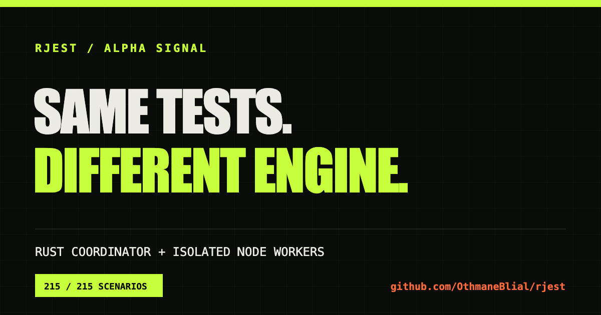

<div align="center">



# Rjest: a Rust-powered Jest-compatible test runner

### JavaScript and TypeScript testing without rewriting your Jest suite

**Keep your tests. Change the engine.**

[Website](https://othmaneblial.github.io/rjest/) · [Compatibility](docs/compatibility.md) · [Migration guide](docs/migration-from-jest.md) · [Architecture](docs/architecture.md)

[](docs/progress.md)
[](compat/jest-compatibility.json)
[](docs/architecture.md)
[](docs/development.md)
[](LICENSE)
[](https://github.com/OthmaneBlial/rjest/stargazers)

</div>

```diff
- npx jest
+ npx rjest
```

That is the goal.

Rjest is built on a stubborn premise: a Jest alternative is only useful if it
runs the Jest suite you already have. Rewriting years of tests, snapshots,
mocks, transforms, and configuration is not a migration. It is a new project.

Rjest keeps JavaScript execution in isolated Node workers and moves discovery,
scheduling, dependency analysis, process control, coverage aggregation, and
reporting into Rust. Every compatibility claim must survive the same fixture
under official Jest and Rjest.

> Alpha status: Rjest already runs substantial React, TypeScript, Node, JSDOM,
> CommonJS, ESM, snapshot, mock, fake-timer, coverage, and monorepo suites. It
> does not cover the entire Jest surface yet, and the npm package is not
> published. Build it from source and keep Jest as your release gate for now.

## The short version

| What you probably want to know                                   | Verified answer                                    |
| ---------------------------------------------------------------- | -------------------------------------------------- |
| Does it use existing Jest tests?                                 | Yes, across the measured surface                   |
| Does it read Jest configuration?                                 | Yes, with explicit errors for unsupported options  |
| Are snapshots, mocks, timers, ESM, JSDOM, and coverage included? | Yes, within the documented boundaries              |
| Is compatibility measured against official Jest?                 | **215 / 215 executable scenarios pass**            |
| Has it run serious public projects?                              | **25 pinned corpus reports**                       |
| Is it production-ready everywhere?                               | No. Current directional readiness is **about 88%** |
| Is it already faster than Jest?                                  | No published claim yet; correctness comes first    |

## Compatibility with receipts

Rjest does not award itself points for having a familiar method name. The
differential harness runs a fixture with pinned official Jest, runs it again
with Rjest, normalizes observable behavior, and compares the results. A fixed
mismatch stays in the repository as a regression test.

Jest 30.5.0 is the default oracle. One snapshot-format probe intentionally uses
Jest 29.7.0.

| Area                 |       Passing | Measured score |
| -------------------- | ------------: | -------------: |
| CLI                  |       36 / 36 |           100% |
| Configuration        |       48 / 48 |           100% |
| Core API             |       14 / 14 |           100% |
| Coverage             |       19 / 19 |           100% |
| Environment          |         7 / 7 |           100% |
| ESM                  |         8 / 8 |           100% |
| Expect               |       12 / 12 |           100% |
| Fake timers          |       12 / 12 |           100% |
| Mocks                |       14 / 14 |           100% |
| Reporters            |         7 / 7 |           100% |
| Resolution           |       12 / 12 |           100% |
| Snapshots            |       15 / 15 |           100% |
| Transforms           |         7 / 7 |           100% |
| Watch                |         4 / 4 |           100% |
| **Versioned matrix** | **215 / 215** |       **100%** |

The 100% above means every scenario currently in the versioned matrix passes.
It does not mean Rjest implements 100% of Jest. The matrix is deliberately
bounded, inspectable, and expected to grow. [Read every measured scenario](compat/jest-compatibility.json).

### Real Jest projects, unchanged

Synthetic fixtures are necessary. They are not enough. Rjest also runs the
original tests and configuration from established open-source projects.

| Project suite                                                 |                        Official Jest baseline |                                            Rjest result |
| ------------------------------------------------------------- | --------------------------------------------: | ------------------------------------------------------: |
| [Downshift](docs/corpus/downshift.md)                         |        92 suites · 1,110 tests · 49 snapshots |                                            Exact parity |
| [React Testing Library](docs/corpus/react-testing-library.md) |          16 suites · 251 tests · 11 snapshots |                             Exact React 19/JSDOM parity |
| [styled-components web](docs/corpus/styled-components.md)     |       59 suites · 1,465 tests · 749 snapshots |                                            Exact parity |
| [React Navigation](docs/corpus/react-navigation.md)           |  81 suites · 1,303 identities · 169 snapshots |    Exact parity, including the same 2 upstream failures |
| [AWS Amplify Auth](docs/corpus/amplify-auth.md)               |                      101 suites · 1,150 tests |             Exact identity, status, and coverage parity |
| [Apollo Client](docs/corpus/apollo-client.md)                 | 563 suites · 9,974 identities · 519 snapshots | 99.940% frozen-status parity · zero Rjest-only failures |

The complete corpus spans React, React Native, TypeScript, Node, JSDOM,
CommonJS, native ESM, npm, pnpm, Yarn workspaces, and Yarn Plug'n'Play. There
are [25 pinned reports](docs/corpus), including commands, versions, results,
timings, and memory where practical.

## Try Rjest on an existing suite

The npm package is not published yet. Build the current alpha from source:

```sh
git clone https://github.com/OthmaneBlial/rjest.git
cd rjest
npm ci
cargo build --release -p rjest-cli
```

Start in an existing Jest project with the lowest-risk comparison:

```sh
cd /path/to/your-jest-project

# Compare discovery first
/path/to/rjest/target/release/rjest --listTests

# Then compare a deterministic serial run
/path/to/rjest/target/release/rjest --runInBand

# Finally, let Rjest schedule files in parallel
/path/to/rjest/target/release/rjest
```

If both runners disagree, reduce the mismatch to one fixture and open an issue.
That report is more useful than a broad request for "more Jest support."

## Familiar Jest commands

```sh
rjest --coverage
rjest --updateSnapshot
rjest --testNamePattern=calculator
rjest --maxWorkers=50%
rjest --projects packages/api packages/web
rjest --selectProjects web --ignoreProjects legacy
rjest --shard=1/3
rjest --randomize --seed=1234
rjest --onlyFailures
rjest --findRelatedTests src/parser.ts src/config.ts
rjest --watch
rjest --watchAll
rjest --forceExit --no-coverage
rjest --no-cache
rjest --clearCache
```

Unsupported configuration is an error. Rjest will not silently ignore a Jest
option and return a reassuring but incomplete test run.

## What works today

### Tests, assertions, and mocks

- `describe`, `test`, `it`, nested hooks, async and callback tests, `.only`,
  `.skip`, `.todo`, `.failing`, retries, bail, sharding, and seeded randomization
- Jest equality, common and asymmetric matchers, custom async matchers,
  `.resolves`, `.rejects`, assertion counts, `expect.arrayOf`,
  `expect.closeTo`, and mock return-history matchers
- `jest.fn`, spies, property replacement, CommonJS and native-ESM mocks, manual
  mocks, automocking, module resets, restoration, and mock generation hooks

### JavaScript, TypeScript, and project configuration

- JavaScript, configured JSX/TypeScript/TSX transforms, CommonJS, native ESM,
  top-level await, Node, JSDOM, and custom test environments
- Executable JS/TS configuration, presets, multi-project runs, display-name
  filters, custom resolvers, custom sequencers, pnpm, and Yarn Plug'n'Play
- CommonJS, ESM, and transformed TypeScript global setup/teardown, custom
  reporters, and test-results processors

### Snapshots, fake timers, coverage, and watch mode

- External and inline snapshots, property matchers, serializers, update mode,
  obsolete detection, Prettier 2/3, and source-mapped inline writes
- Modern and legacy fake timers across measured Node and JSDOM boundaries,
  including Jest 30 manual, next-async, and interval tick modes
- Babel/Istanbul and V8 coverage, cross-worker merging, source maps,
  `collectCoverageFrom`, common reports, and scoped thresholds
- Native filesystem watching, Git-aware affected-test selection, interactive TTY
  controls, and interruption of active parallel workers

The exact boundary is documented in [Jest compatibility](docs/compatibility.md).

## Why Rust and Node?

```text
01 RUST / PLAN          02 NODE / RUN           03 RUST / REPORT
config + discovery  ->  isolated test workers  ->  results + snapshots + coverage
```

Rust owns coordination: filesystem scans, configuration normalization,
dependency graphs, scheduling, worker lifecycles, aggregation, coverage merging,
and snapshot persistence.

Node owns JavaScript semantics: module loading, Jest transformers, custom
environments, runtime extensions, and the test code itself.

Each test file currently gets a fresh worker process. Isolation is strong and
aggregation stays deterministic, but startup cost is real. Worker reuse and
persistent transform/discovery caches remain open work. The architectural
reasoning starts in [ADR 0001](docs/adr/0001-hybrid-node-runtime.md).

## Correctness before speed

There is deliberately no "10x faster" badge in this README. The project has not
published a controlled performance result yet, and some transform-heavy suites
are currently slower than Jest because workers are not reused.

When benchmarks are published, they will include the exact suite, machine,
versions, commands, warm-up policy, medians, variance, and peak memory. A runner
that skips behavior does not get to call itself fast. See the
[benchmark policy](docs/benchmarks.md).

## Honest alpha boundaries

The current project-readiness estimate is approximately **88%**. This is a
directional engineering estimate, not an automated percentage of the Jest API.
The automated number is the 215-scenario matrix above.

- Watch plugins, Mercurial/Sapling changed-file selection, and some terminal
  output details remain open.
- Transform and discovery caches are not persisted, and workers are not reused.
- Exact custom-environment VM identity, specialized reporter built-ins, and
  long-tail resolver/PnP combinations need broader proof.
- Basic TypeScript can use Node's erasable syntax. TSX and TypeScript that needs
  code generation still require a configured Jest transformer.
- Unlisted behavior is not a compatibility claim, even when it happens to work.

Before using Rjest as a release gate, read the [migration guide](docs/migration-from-jest.md).

## Verify the evidence

```sh
make check
```

That command runs Rust formatting, strict Clippy, all workspace tests,
JavaScript syntax and comparator tests, and every differential fixture against
the pinned official Jest oracles. The current local Rust suite is 117/117, and
the generated compatibility matrix is 215/215.

## Help close the next gap

The most useful contribution is one small proof that Jest and Rjest disagree:

1. Reproduce it with official Jest.
2. Add the smallest differential fixture that captures the behavior.
3. Fix Rjest without weakening the fixture.
4. Keep the regression forever.

[Open an issue](https://github.com/OthmaneBlial/rjest/issues) · [Read the development guide](docs/development.md) · [See current progress](docs/progress.md)

If the idea of a compatibility-first Jest alternative makes sense to you,
[star Rjest](https://github.com/OthmaneBlial/rjest) and try one real suite. One
precise mismatch is enough to move the project forward.

## Project map

- [Compatibility matrix](docs/compatibility.md)
- [Migration from Jest](docs/migration-from-jest.md)
- [Architecture](docs/architecture.md)
- [Benchmarks](docs/benchmarks.md)
- [Real-project corpus](docs/corpus)
- [Development](docs/development.md)
- [Debugging](docs/debugging.md)
- [Architecture decisions](docs/adr)

## License

MIT. Rjest is an independent project. Jest attribution is recorded in
[NOTICE.md](NOTICE.md).
